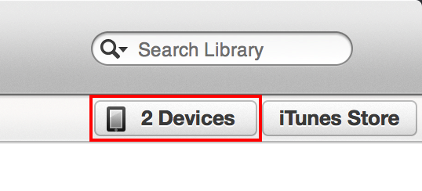

# Alfred 2 Workflow for iTunes Up Next

A workflow for Alfred 2 that adds songs to Up Next in iTunes.

## Setup

After installing (see the installation section below), you'll need to pair Alfred with iTunes just like you would with the iOS Remote app.

### Step 1: Open iTunes

iTunes must be open to complete the pair process.

### Step 2: Begin Paring
Invoke Alfred and type `pair ` followed by a 4-digit numeric pin number and hit enter.

### Step 3: Pair With iTunes
Switch to iTunes and click the devices button in the top right as shown in the screenshot below.

Then click on Alfred in the devices list and enter your 4-digit pin.

## Usage

Usage is incredibly simple. Just type `next` followed by the name of a song and Alfred will present you with a list of songs in your iTunes library that match the search term.

Currently only song titles are supported for searching. Other meta data will be searchable in the future.

## Installation

There are two ways to install this workflow:

### Regular Users

Just download the [alfred-up-next.alfredworkflow](https://github.com/edc1591/alfred-up-next/raw/master/alfred-up-next.alfredworkflow) file and import it into Alfred 2.

### Advanced Users

You can `clone` or `fork` this repository and use `rake install` to install it. This method creates a symlink in the Alfred workflows directory. This method is more suitable for developers.