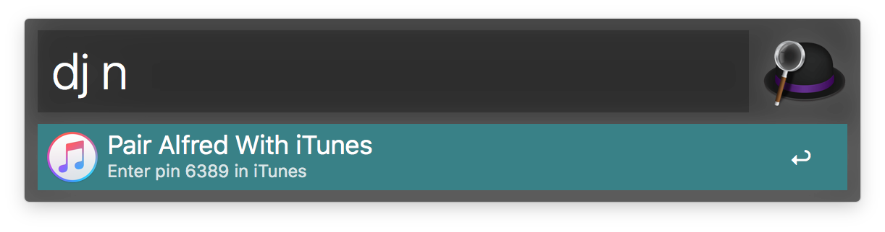
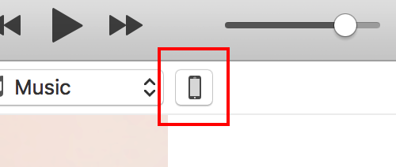
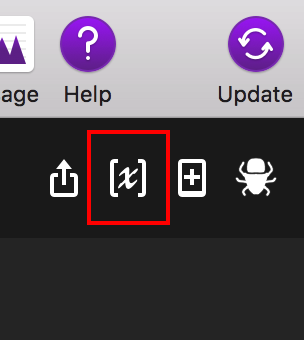

# Alfred iTunes DJ

A workflow for Alfred that queues up songs to be played next in iTunes.

## Pairing

On your first use, you'll need to pair Alfred with iTunes just like you would with the iOS Remote app.

1. Open iTunes.

2. Invoke Alfred and type `dj ` followed any character. Alfred should prompt you that you need to pair with iTunes and give you a four-digit code. Hit enter/return to start the pairing process.

    

3. Switch to iTunes and click the devices button in the top right as shown screenshot below.

    

4. Then click on `Alfred iTunes DJ` in the devices list and enter your four-digit pin.

## Usage

Usage is incredibly simple. Just type `dj` followed by any combination of a song's name, artist or album title and Alfred will present you with a list of songs in your iTunes library that match the search term.

## Configuration

Alfred DJ only has one configurable setting. If you'd like to receive a notification to confirm that a song has been successfully queued, perform the following steps.

1. Open Alfred's preferences and select the `Workflows` tab.

2. Select iTunes DJ from the list and then click the variable button in the top right

    

3. Set the value of `confirm_queued` to `true` to enable confirmation notifications.

## Installation

There are a few ways to install this workflow:

1. [Download the Github releases](https://github.com/edc1591/alfred-itunes-dj/releases/download/2.0/iTunes.DJ.zip)
2. [Download from Packal.org]()
3. Use the source code from this repo.

## Screenshots

## TODO
* ~~Allow searching using artists and albums~~
* ~~Add album artwork to search results~~